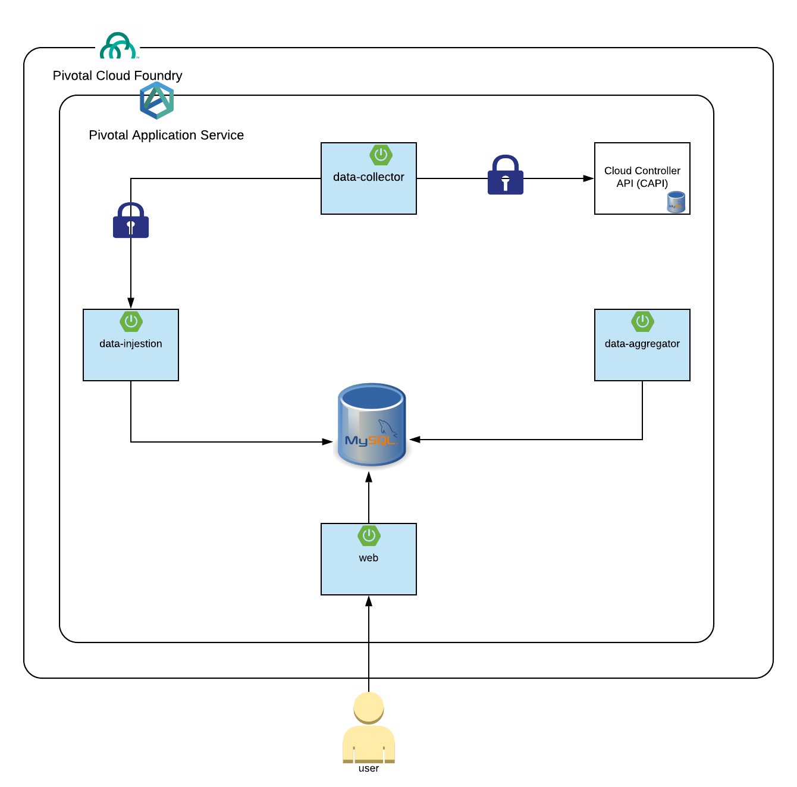

# Phoenix Dashboard Microservices

This is a multi-module maven project consisting of 4 microservices that collect usage data from multiple PCF foundations, and provide an aggregated view of this data.

The modules consist of:
* [data-collector](data-collector/README.md) - a microservice that collects data from cloud controller api and sends to the data-injestor so it can be persisted and eventually aggregated
* [data-injestion](data-injestion/README.md) - a microservice that provides a secure api that can injest data from the data collector and persist in a RDBMS (mysql).
* [data-aggregator](data-aggregator/README.md) - a microservice that aggregates injested data and aggregates.
* [web](data-web/README.md) - a microservice that serves api's.

Here is a diagram:
